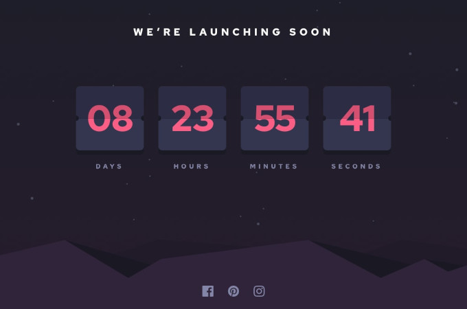

# Launch countdown timer

Created using Less, jQuery and Webpack.
Solution for a challenge on [FrontendMentor](https://www.frontendmentor.io/)

[View Live Site](https://srikant-n.github.io/fm-launch-countdown-timer/dist)



- Contains a Timer that starts at 14 days when the page is refreshed
- Created flip animation using CSS


### Built With

- [Less](http://lesscss.org/)
- [jQuery](https://jquery.com/)
- [Webpack](https://webpack.js.org/)

## The challenge

The challenge is to build out this countdown timer and get it looking as close to the design as possible.

Users should be able to:

- See hover states for all interactive elements on the page
- See a live countdown timer that ticks down every second (start the count at 14 days)
- **Bonus**: When a number changes, make the card flip from the middle

[Challenge info on Frontend Mentor](https://www.frontendmentor.io/challenges/launch-countdown-timer-N0XkGfyz-)


## How To Use

To clone and run this application, you'll need [Git](https://git-scm.com) and [Node.js](https://nodejs.org/en/download/) (which comes with [npm](http://npmjs.com)) installed on your computer. From your command line:

```bash
# Clone this repository
$ git clone https://github.com/srikant-n/fm-launch-countdown-timer.git

# Install dependencies
$ npm install

# Run the app
$ npm start

# Visit app on localhost:8080
```

## Contact

- Website [srikant-n.github.io](https://srikant-n.github.io/)
- GitHub [@srikant-n](https://github.com/srikant-n)